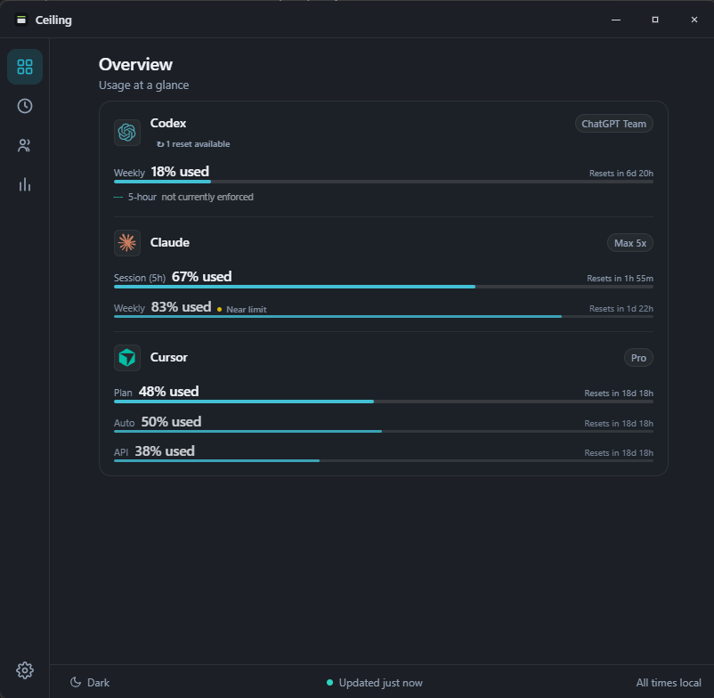
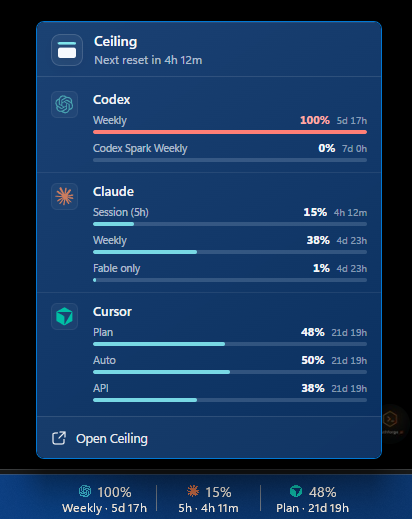

<p align="center">
  
</p>

<h1 align="center">Ceiling</h1>

<p align="center"><strong>AI usage. One elegant view.</strong></p>

<p align="center">
  <a href="https://github.com/tsouth89/ceiling/releases/latest"></a>
  
  <a href="LICENSE"></a>
  <a href="https://discord.gg/Xsn27MxdBA"></a>
  
</p>

<p align="center">
  <a href="https://ceiling.win/download"><strong>Download for Windows</strong></a>
  &nbsp;·&nbsp; <a href="https://ceiling.win">ceiling.win</a>
  &nbsp;·&nbsp; <a href="https://github.com/tsouth89/ceiling/releases">all releases</a>
</p>

---

Ceiling is a focused, local-first Windows companion for the AI subscriptions you actually use. It keeps rolling limits, reset times, and stale/error states visible from the system tray or a lightweight capacity strip above the taskbar.

The goal is not another giant provider dashboard. It is a fast, calm way to answer one question: **how much AI capacity do I have left, and when does it reset?**

## Initial focus

- OpenAI Codex
- Claude
- Cursor
- Gemini / Google AI
- GitHub Copilot

Additional providers remain available from the underlying foundation while Ceiling is narrowed around reliable support for the core five.

<p align="center">
  
</p>

## What Ceiling feels like

- **Taskbar-adjacent capacity strip:** Windows 11 does not support old-style third-party taskbar toolbars, so Ceiling uses a transparent, always-on-top strip that sits just above the taskbar without stealing focus.
- **Tray at a glance:** a compact flyout with each provider's remaining capacity, reset time, source, and freshness.
- **Truthful state:** a visible distinction between live, cached, stale, and failed reads. No fake precision when a provider cannot report a limit cleanly.
- **Usage and reset alerts:** optional toasts when you approach a limit, and when a window resets unexpectedly, is restored, or grants a banked reset.
- **Local first:** credentials and usage data stay on the machine. Browser cookies, API keys, and login sources remain opt-in.
- **Windows-native:** Tauri, React, and Rust; fast startup, low idle work, and system accent-aware appearance.

<p align="center">
  
</p>

## Download

Ceiling runs on Windows 10 and 11.

**[Download for Windows](https://ceiling.win/download)** &nbsp;·&nbsp; [ceiling.win](https://ceiling.win) &nbsp;·&nbsp; [all releases](https://github.com/tsouth89/ceiling/releases)

The installer and portable build are code-signed. Ceiling is local-first: it reads usage from sources on your PC or from each provider's own usage endpoint, and never sends your credentials or usage data to Ceiling-operated servers. See [How Ceiling gets your data](docs/DATA_SOURCES.md) for the per-provider detail.

## Development

```powershell
git clone https://github.com/tsouth89/ceiling.git
cd ceiling
pnpm --dir apps/desktop-tauri install --frozen-lockfile
pnpm --dir apps/desktop-tauri tauri:dev
```

The active desktop app lives in `apps/desktop-tauri`. Shared provider and usage logic lives in `rust`.

For the active implementation state and the next work items, see
[docs/HANDOFF.md](docs/HANDOFF.md). For the tray and strip visual system, see
[docs/CEILING_UI.md](docs/CEILING_UI.md). Maintainers should follow the
[release checklist](docs/RELEASING.md) for public builds.

## Lineage, license, and credits

Ceiling is an independent Windows-focused fork of
[Win-CodexBar](https://github.com/Finesssee/Win-CodexBar), which is itself based
on Peter Steinberger's [CodexBar](https://github.com/steipete/CodexBar). Ceiling
is not affiliated with or endorsed by either upstream project.

The project is released under the [MIT license](LICENSE). The original copyright
and license notice are retained as required by that license.
