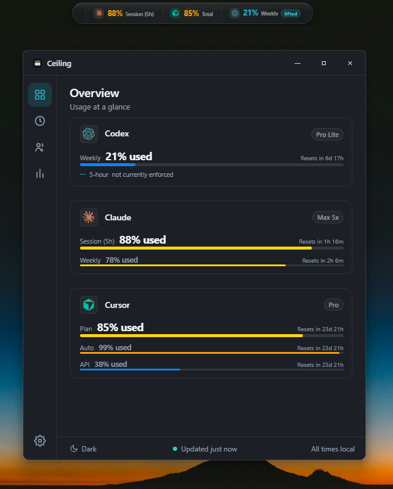

# Ceiling

**A quiet Windows app for keeping AI usage limits in view.**

[Download for Windows](https://github.com/tsouth89/ceiling/releases/download/v0.43.2/Ceiling-0.43.2-Setup.exe) · [ceiling.win](https://ceiling.win) · [All releases](https://github.com/tsouth89/ceiling/releases)

<p align="center">
  
</p>

Ceiling shows the rolling limits and reset times for the AI subscriptions you use. It lives in the Windows tray and can keep a compact capacity bar just above the taskbar, so checking what is left never means opening five different account pages.

## What it tracks

- OpenAI Codex
- Claude
- Cursor
- Gemini / Google AI
- GitHub Copilot

Each provider stays separate. Ceiling reports where a reading came from and distinguishes current, cached, stale, and unavailable data instead of inventing precision.

## Built for the background

- A small always-on-top capacity bar that does not steal focus
- A clean overview for every connected provider
- Reset times and dependable high-usage alerts
- Automatic credential discovery where the installed provider app supports it
- Local-first storage for credentials and usage data
- Native Windows tray behavior, startup support, and signed releases

## Install

Download the signed [Ceiling 0.43.2 installer](https://github.com/tsouth89/ceiling/releases/download/v0.43.2/Ceiling-0.43.2-Setup.exe), or use the [portable build](https://github.com/tsouth89/ceiling/releases/download/v0.43.2/Ceiling-0.43.2-portable.exe).

Ceiling is early software. Provider APIs and account pages can change without notice, so usage readings should be treated as a convenient view of the provider's own meter, not a billing record.

## Development

```powershell
git clone https://github.com/tsouth89/ceiling.git
cd ceiling
pnpm --dir apps/desktop-tauri install --frozen-lockfile
pnpm --dir apps/desktop-tauri tauri:dev
```

The active desktop app lives in `apps/desktop-tauri`. Shared provider and usage logic lives in `rust`.

See [docs/HANDOFF.md](docs/HANDOFF.md) for the active implementation state, [docs/CEILING_UI.md](docs/CEILING_UI.md) for the visual system, and [docs/RELEASING.md](docs/RELEASING.md) for the release process.

## Lineage and license

Ceiling is an independent Windows-focused fork of [Win-CodexBar](https://github.com/Finesssee/Win-CodexBar), which is based on Peter Steinberger's [CodexBar](https://github.com/steipete/CodexBar). Ceiling is not affiliated with or endorsed by either upstream project.

Released under the [MIT license](LICENSE). The original copyright and license notice are retained.
